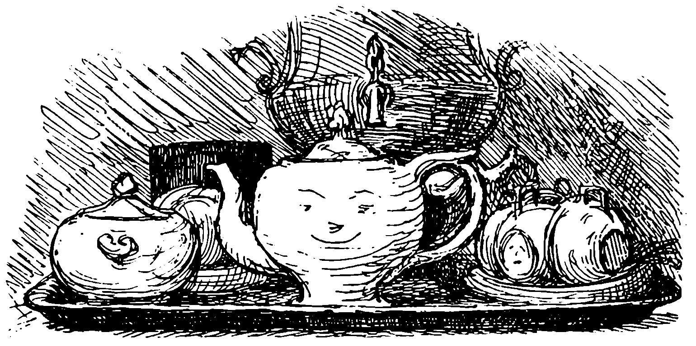

Lorenz Frolich (1820-1908), 1871 illustration for Andersen's 'The Teapot' · Public domain

A late, miniature Andersen tale (Danish *Theepotten*, first printed December 1863
in a Danish almanac), narrated in the first person by the teapot itself — one of
his object-narrator pieces, kin to "The Darning Needle" and "The Collar." It opens
on pure vanity:

> "There was once a proud teapot; it was proud of being porcelain, proud of its
> long spout, proud of its broad handle."

What it will not mention is its one flaw — a cracked, riveted lid; "one does not
speak of one's defects — others do that." At a tea party a nervous hand drops it,
the spout and handle snap, and the teapot, now useless as a teapot, is given away
to the poor. There it is redeemed by a humbler office: a flower bulb is planted in
its body, and for one season the broken pot becomes a cradle for living growth and
knows, for the first time, real joy. The bloom is lifted out to a proper garden
pot; the teapot is thrown into the yard as a potsherd, and closes on its single
consolation:

> "But I have the memory, and that I can never lose."

## In the braid

The arc is the archetype the corpus files under `char:arc-service`: meaning found
not in the vain prime but in humble use, and kept as memory once the use is gone.
It is the exact **inverse** of [[bunbuku-chagama]], whose kettle *refuses* to serve
— sprouts legs and bolts from the fire — so the two folktales bracket the whole
service-vs-refusal axis that also reaches into HTTP 418 and the chocolate teapot.
And it rhymes, in a quieter key, with [[baillie-lines-to-a-teapot]]: both are
teapot *biographies* that trace one vessel from prized to discarded — Baillie's a
social satire of lost fashion, Andersen's a spiritual reversal in which breaking
is the beginning of grace.
