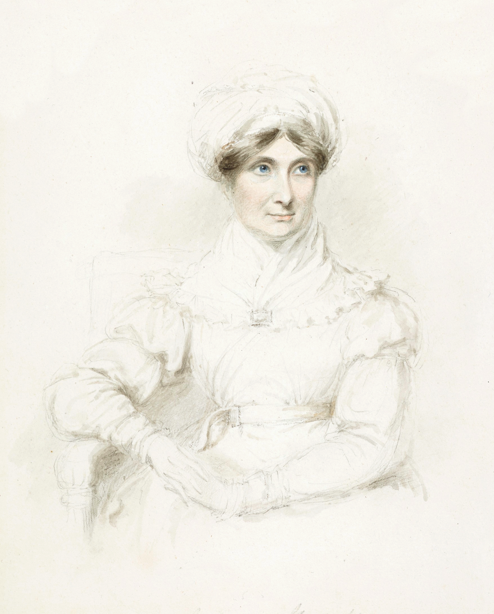

Mary Ann Knight (1776-1851), portrait of Joanna Baillie · Public domain

The Scottish poet-playwright's poem is addressed *to* a Chinese porcelain teapot,
tracing its whole life: born in a distant kiln, carried across the ocean, prized in
fashionable British drawing rooms, then slipping into neglect and the scrutiny of
"sober connoisseurs." A rare work where the teapot is the sole subject and
addressee — an Enlightenment meditation on commodity, empire and transience. The
non-fiction rhyme of [[andersens-teapot]]: both trace a teapot's arc from prized to
discarded (queryable together by the `object-lifecycle` tag).
