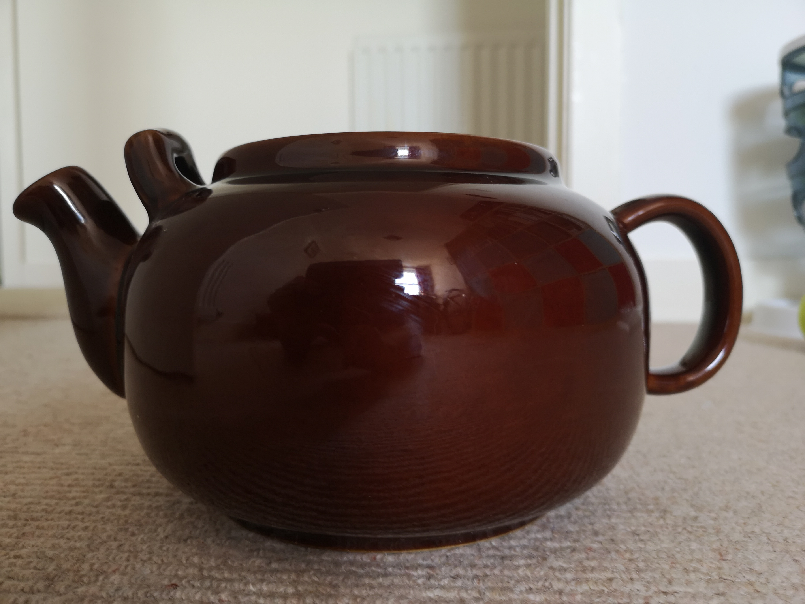

Protosaurus (Wikimedia Commons) · CC BY-SA 4.0

The round, red-terracotta teapot with a dark manganese glaze from Stoke-on-Trent —
Britain's "people's teapot," made by the hundred thousand and claimed to brew the
best cup thanks to its heat-retaining local clay and rounded body. Where
[[marianne-brandt-teapot]] and [[peter-shire-teapots]] are *art*, the Brown Betty
is the vernacular **archetype**: the teapot most Britons picture when they picture
a teapot. That makes it a `reference-object` in the cultural sense that the
[[utah-teapot]] is one in the computational sense — the default teapot of a whole
population.
