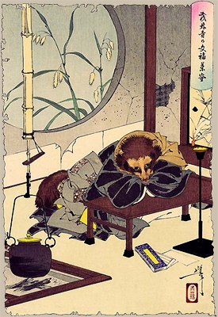

Tsukioka Yoshitoshi (1839-1892), c.1889-92 · Public domain

In A. B. Freeman-Mitford's 1871 telling — "The Accomplished and Lucky Teakettle,"
from *Tales of Old Japan* — the story opens plainly:

> "A long time ago, at a temple called Morinji… there was an old tea-kettle."

The kettle is a tanuki (raccoon-dog) in disguise. Set over the hearth to boil, it
cannot bear the heat, sprouts a head, legs and a bushy tail, and bolts. Sold
cheaply to a poor tinker who treats it kindly, it repays him by singing and
dancing acrobatics — famously walking a tightrope — until crowds pay to watch and
the tinker grows rich; in the end it is returned to the temple and, in Mitford's
phrase, "worshipped as a saint." The tale is stitched to a real place: Morin-ji in
Tatebayashi, Gunma, which claims the actual relic kettle and whose grounds are
lined with tanuki statues — so pilgrims meet the fiction as fact. That crossing is
why the entry carries `ontology-shift`: one thread spanning folktale and temple
object, kept in a single entry.

## In the braid

Bunbuku is the exact **inverse** of [[andersens-teapot]]. Andersen's teapot finds
its meaning in humble service; Bunbuku's kettle *refuses* it — recoils from the
fire, abandons its utensil role, and becomes a performer. The two folktales
bracket the whole **service-vs-refusal** axis (`char:arc-service` against
`char:arc-refusal`) that also reaches across into [[http-418-im-a-teapot]] and the
[[chocolate-teapot]]. And the tale keeps generating vessels: Eiichiro Oda's *One
Piece* gives Wano a living teapot-tanuki named Bunbuku — inverting the inversion, a
teapot that became a tanuki rather than a tanuki that became a teapot, and one that
still cannot bear fire.
