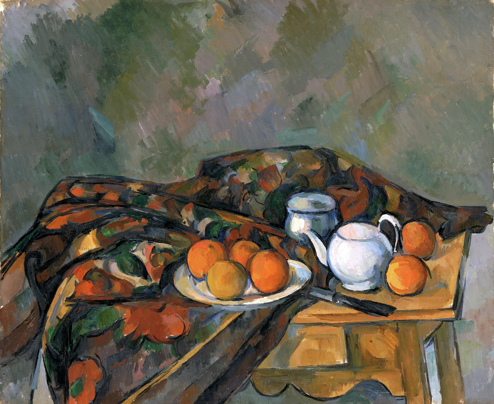

Paul Cezanne; digitized by Amgueddfa Cymru - Museum Wales · Public domain (CC0)

Cézanne's teapot sits among fruit and crockery on a draped table, one weight in
his lifelong study of how solid forms hold and balance in space. The corpus's sole
`representational` entry — the teapot exists here as a *depicted image*, not a pot
you could pour from — and the register's whole reason for being: what's on the
canvas is a picture of a teapot, distinct from the real pot Cézanne set up to
paint. Central by the ensemble tie-breaker (it's named in the title). Shares the
`formal-study` mode with [[marianne-brandt-teapot]].
