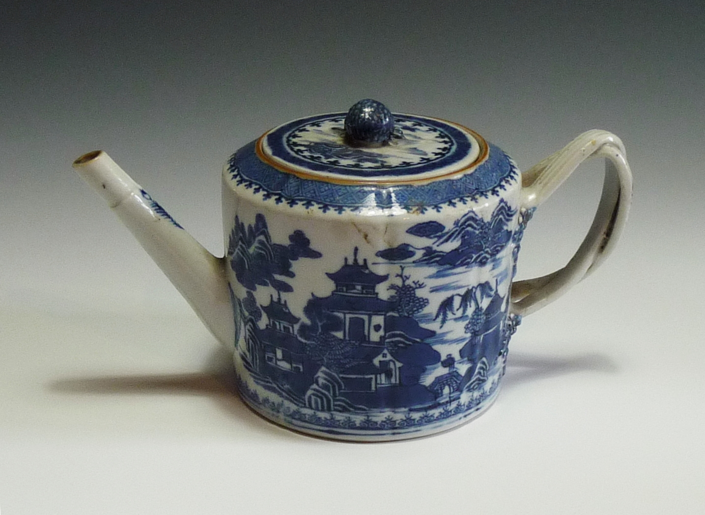

Theroadislong (Wikimedia Commons) · CC BY-SA 3.0

Carolyn Lee Boyd's decades-long writing practice (goddessinateapot.com) takes the
teapot as its emblem of everyday sacredness: a vessel gathering earth, air, fire
and water, a small domestic object made holy. A New England-based poet, essayist
and blogger who also contributes to *Feminism and Religion* — she has even
published a short story titled "The Spirit in the Teapot." The corpus's anchor
`discursive` entry: the teapot not as object or argument but as an *organising
idea a person writes and lives through*.
