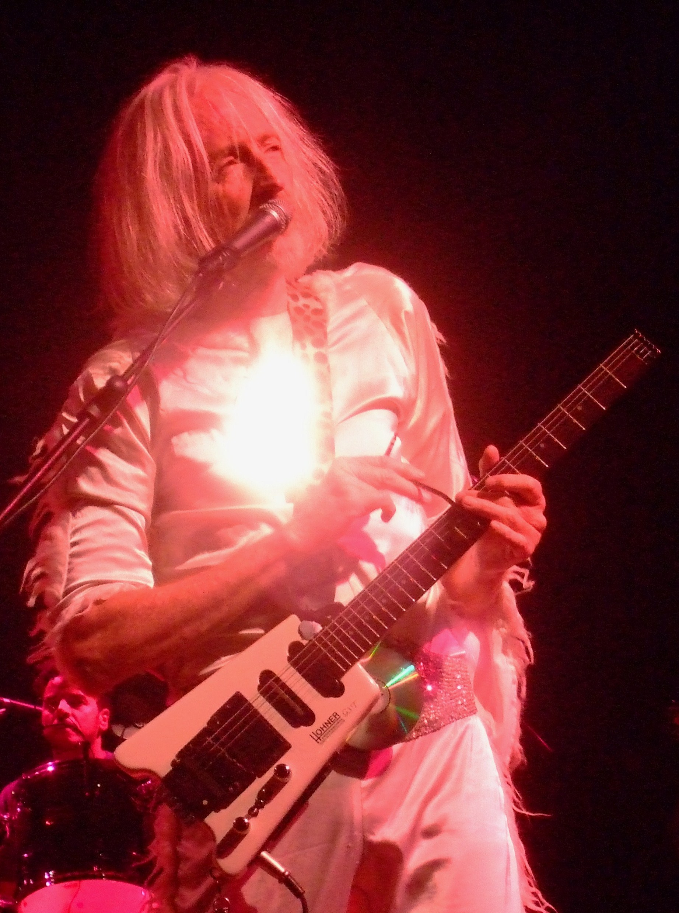

Pequod76 (Wikimedia Commons) · CC BY-SA 3.0

Daevid Allen built the entire Planet Gong cosmology of the *Radio Gnome Invisible*
trilogy (opening with *Flying Teapot*, 1973) around a cosmic flying teapot — the
album title itself a wink at [[russells-teapot]]. A whole psychedelic mythology
anchored to the vessel: `cosmic-projection` and `veneration` fused into an
artist's visionary universe. The `alludes-to` edge (not `responds-to`) is exact —
Gong invokes Russell's teapot as an image, it does not argue with him.
