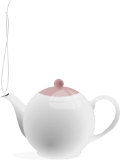

donchico / Openclipart · CC0

Defined in RFC 2324 — the Hyper Text Coffee Pot Control Protocol, an IETF April
Fools' joke published by Larry Masinter on 1 April 1998. HTCPCP invents a `BREW`
method for controlling networked coffee pots, and with it the one status code
everybody remembers:

> "Any attempt to brew coffee with a teapot should result in the error code
> '418 I'm a teapot'. The resulting entity body MAY be short and stout."

That last clause is the joke's grace note — a straight quotation of
[[im-a-little-teapot]] smuggled into a protocol spec. 418 is a *category* refusal:
the client has asked a teapot to do the one thing a teapot will not do, and the
teapot answers by stating what it is.

The gag then grew a life of its own. It ships as real code — Go's `net/http`
exports `StatusTeapot = 418`, Node returns `"I'm a Teapot"` — and in 2017, when
the IETF's Mark Nottingham proposed stripping the non-standard code from
frameworks, a fifteen-year-old developer, Shane Brunswick, put up **save418.com**
("a reminder that the underlying processes of computers are still made by
humans"). It went viral within hours; Node, Go, Python's Requests and ASP.NET all
kept the code; and in 2022 RFC 9110 formally **reserved** 418 so it can never be
reassigned. The joke is now protected by the standard.

## In the braid

418 is one of the two teapots that *name themselves* — "I'm a teapot" beside "I'm
a little teapot" — a pair joined not by a hard edge but by the shared `self-naming`
tag, and, with the [[teapot-emoji]], the nucleus of the self-reference thread the
whole braid may hang on. It also anchors the **refusal** cluster: the teapot that
declines the task it was never built for, kin to the badger who leaps off the fire
([[bunbuku-chagama]]) and the [[chocolate-teapot]] that is declared useless and
works anyway. Russell's teapot is a teapot invoked to make a point; so is this one
— a teapot-as-argument about how software gets abused, and about the humanity
encoded in a joke a community refused to let die.
