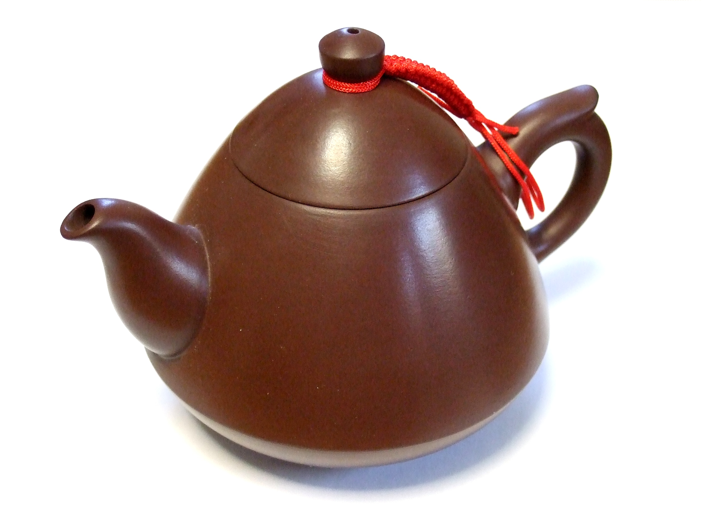

Haragayato (Wikimedia Commons) · CC BY-SA 2.5

Written in 1939 by George Harry Sanders and Clarence Z. Kelley for Kelley's
children's dance school, where the youngest pupils couldn't manage the "Waltz Clog"
tap routine. Sanders's answer needed almost no skill, only pantomime — the child
doesn't sing *about* a teapot, the child *becomes* one:

> "I'm a little teapot, short and stout; / here is my handle, here is my spout…"

Arm bent for the handle, arm out for the spout, and on the last line — "tip me over
and pour me out" — the whole body performs the vessel giving out. For a great many
people it is the first thing they ever act.

A 1941 writer (widely quoted as *Newsweek*, though the citation is hard to pin
down) dismissed it as the next "inane novelty song to sweep the country." The
prediction has aged into irony: it outlasted the songs printed beside it and became
a near-universal nursery standard — the [[chocolate-teapot]] pattern again,
declared trivial and enduring anyway.

## In the braid

This is the corpus's only `performative` teapot — it exists only while enacted —
and the anchor of the **self-naming** cluster. "I'm a little teapot" is the human,
sung ancestor of [[http-418-im-a-teapot]]'s "I'm a teapot" (the RFC even quotes it:
a response body that "MAY be short and stout") and of the [[teapot-emoji]], the
same declaration compressed to a glyph. Its most direct descendant is
[[teapotting]], the 2011 photo fad that stripped the pose from the nursery and had
adults strike it for the camera. Four teapots, 1939 to 2020, all making the same
first-person claim: *I am a teapot.*
