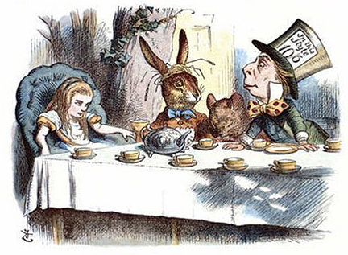

John Tenniel, 1865 · Public domain

Carroll's Mad Tea Party stages tea ritual as pure disorder — riddles without
answers, a table endlessly reset, time itself broken. Per the accessory-teapot
rule, this entry is **scoped to the teapot-central beat**: the Dormouse being
stuffed head-first into the teapot, the vessel as a place to *put* an inconvenient
creature. `hospitality` inverted into `trickster` chaos. A graph hub — later works
(the *Tempest in a Teapot* play) point back here via `mashes-up`.
