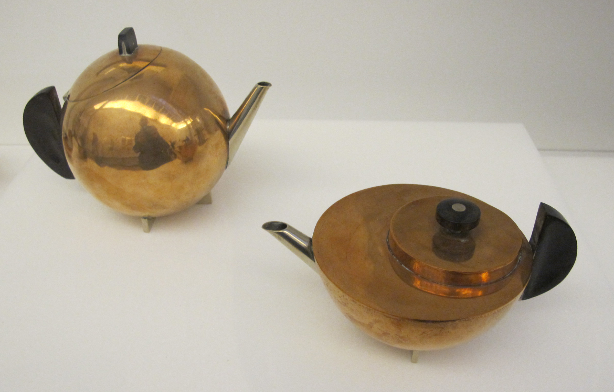

Photo Sailko; Bauhaus Museum Weimar · CC BY-SA 3.0

Brandt's Bauhaus teapot reduces the object to elemental geometry — a hemispherical
body, a disc lid, a crisp cross-bar handle — a Constructivist exercise in pure
form rather than a thing meant for daily use. Now in MoMA's collection, it is the
teapot as design manifesto: proof that the humble vessel can carry the whole
weight of a modernist argument about how objects should be. The `formal-study`
mode's exemplar, alongside [[cezanne-still-life-with-teapot]].
