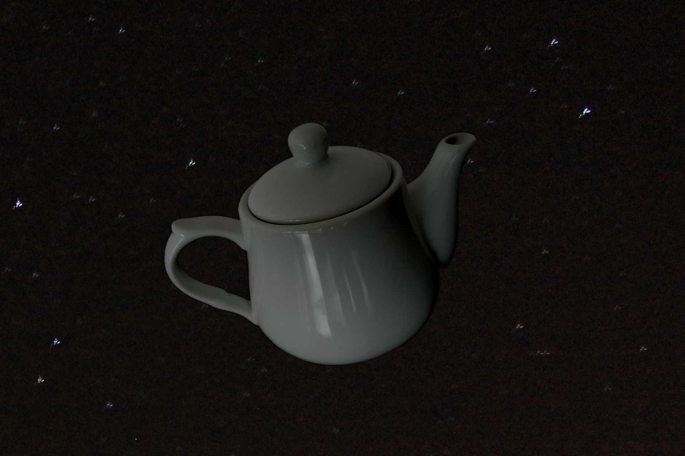

Wikimedia users Walaa & Remember the dot · CC BY-SA 4.0

Jamie Perrelet's own theory, from his MSc dissertation *A Descent into the Quantum
Teapot* (2014), and a direct response to [[russells-teapot]] — named to parallel
it. Russell puts the burden of proof on whoever asserts an unfalsifiable claim.
Perrelet's teapot goes further and argues the burden of proof is *itself*
nonsensical, because physics admits **indistinguishable formulations of its own
laws**.

The dissertation's worked example is Martin Gardner's concave hollow-earth model:
turn the cosmos inside-out into a spherical cavity and, with the physical laws
transformed to match, no experiment can tell it from standard cosmology — it
survives only because Occam's razor cuts it away, and the razor has its own strong
counter-claims. Since the curvature of any proposed cosmology can be cancelled by
the appropriate inverse transformation of the laws, the argument runs to its limit
and lands, deadpan, on hospitality:

> "If I claim the universe is in the shape of a teapot, then there's no point
> worrying about the validity of my beliefs and we should probably just have a cup
> of tea instead."

## In the braid

This is the hinge the whole collection turns on. It takes the exact object Russell
built for skepticism and reclaims it for devotion — the same teapot, the same
unfalsifiability, pointed the other way: not "therefore doubt" but "therefore sit
down." Structurally it is a strange loop, the skeptic's teapot and the devotee's
teapot occupying one shape, which is why the entry carries both `epistemological`
and `veneration`. It is the corpus's only edge that **responds to** the root, and
the reason the archive reads as an argument rather than a list: everything else
catalogues the teapot's meanings; this one makes a claim about them.
