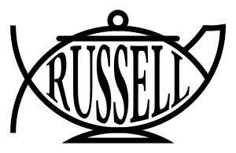

Conquistador (Wikimedia Commons) · CC BY-SA 3.0

Russell's analogy: a china teapot too small to be detected by any telescope,
orbiting the Sun somewhere between Earth and Mars. Precisely because its
existence cannot be *disproven*, someone might insist on it — but the burden of
proof lies with the one making the claim, not with the skeptic asked to accept
it.

The keystone of the entire collection. It is the reference every later teapot
either answers, inverts, or plays against, and it fixes the teapot as the
canonical object of **unfalsifiable belief**. Jamie's own theory turns it
inside out — see [[perrelets-teapot]].
