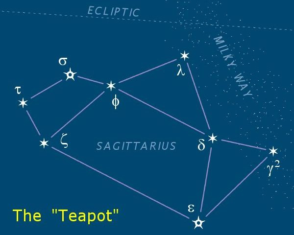

Eoghanacht (Wikimedia Commons) · Public domain

Eight bright stars of Sagittarius form an unmistakable teapot — bowl, handle,
lid and spout. Its finest detail is cosmic pareidolia at its best: the dense star
clouds of the Milky Way's centre rise from the *spout*, so the sky appears to
show steam pouring from a celestial teapot. The same `found-form` phenomenon as
[[teapot-rock]], projected onto the stars instead of sandstone (queryable
together by the `pareidolia` tag). The spout is what makes the whole picture
work — the dense star clouds of the galactic centre rising from it like steam.
