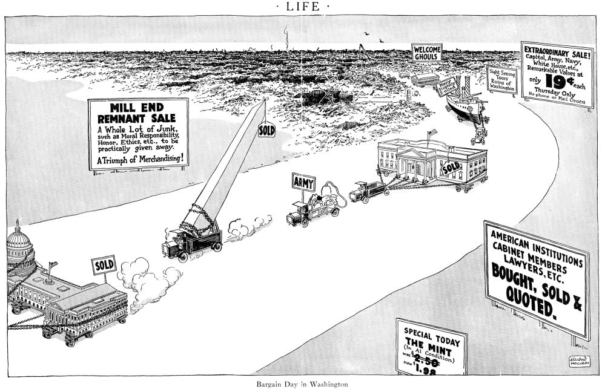

Ellison Hoover, LIFE magazine (1924) · Public domain

**Contrast-set entry (peripheral).** The scandal that made "Teapot Dome" famous
contains no teapot at all. Interior Secretary Albert Fall secretly leased the
Teapot Dome naval oil reserve — named after [[teapot-rock]] above it — to private
tycoons in exchange for bribes, and became the first US cabinet officer convicted
of a felony for acts in office.

The teapot survives here only as `linguistic` residue: a `namesake` three hops
from any actual vessel. It **fails Perrelet's centrality gate** — the teapot is
not the tenant — and is kept solely to demonstrate the gate working. The teapot
that *is* central lives in [[teapot-rock]] and [[teapot-dome-station]].
