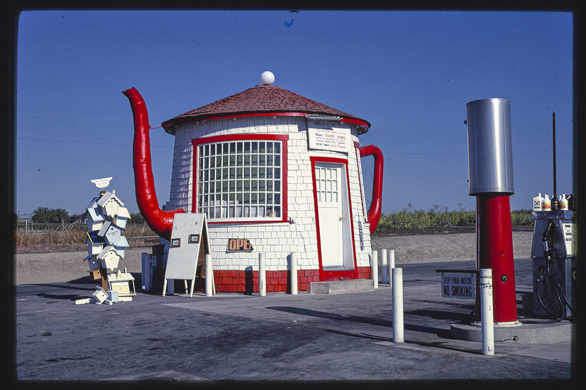

John Margolies / Library of Congress · Public domain (no known restrictions)

A gas station built in 1922 by Jack Ainsworth in the shape of a giant teapot —
spout, handle and all — as a wry roadside jab at the unfolding
[[teapot-dome-scandal]]. Here the teapot is deliberately *made*: a physical
`effigy` (ontology `material`) needling the corruption its name had come to stand
for. Listed on the National Register of Historic Places in 1985, it was moved from
its original highway site to 117 First Avenue, Zillah in 2012, where it now serves
as the town's visitor centre — outliving the scandal by a century. It shares
`scandal-power` with [[teapot-dome-scandal]] while sitting on the opposite side of
the centrality gate.
