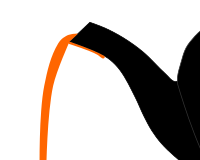

Pedalito (Wikimedia Commons) · CC0

The dribble: pour slowly from a teapot and the stream, instead of arcing into the
cup, creeps back under the spout and runs down the outside. The rheologist Markus
Reiner named it the "teapot effect" in *Physics Today* in 1956 and blamed
Bernoulli's principle — faster flow, lower pressure, air pushing the stream onto
the lip. He was only partly right, and the full explanation took another
sixty-five years.

It is a genuinely hard problem, because it couples three competing forces at a
sharp edge. **Inertia** wants the liquid to fly straight off the lip (which is why
pouring *faster* stops the drip). **Capillary and wetting forces** pin a tiny drop
to the sharp underside of the spout, keeping it permanently wet and dragging the
stream around the corner. **Viscosity** mediates the boundary layer between them.
Below a critical pouring speed the wetting wins and the pot dribbles; above it,
inertia wins and the stream separates cleanly. In 2010 a Lyon group (Duez, Ybert,
Clanet & Bocquet) showed the dribble can be almost abolished by making the lip
superhydrophobic or its radius vanishingly small — the "hydro-capillary" result —
and in 2021 a TU Wien / UCL team (Scheichl, Bowles & Pasias) finally supplied the
complete theory. Their summary is almost an apology:

> "Although this is a very common and seemingly simple effect, it is remarkably
> difficult to explain it exactly within the framework of fluid mechanics."

The engineer's fixes turn out to be old folk knowledge made rigorous: a sharp
knife-edge lip, an undercut drip-groove, a spout that makes the liquid travel
slightly *uphill* first.

## In the braid

This is the purest `spout: yes` entry in the whole corpus — the one teapot that
exists not as an object but as a *behaviour of the spout itself*, which is why its
`form` is `phenomenon` and its register is `material` (a physical process, not a
posit — its existence was never in doubt, only its explanation). It is the
hard-physics core of the **spout hypothesis**: that the teapot is the vessel
defined not by what it holds but by how it *gives out*.
Its kin are the other spout-central entries — the twin channels of the
[[assassin-teapot]], and the long, sharp, high-pouring spout of the
[[moroccan-berrad]], a culturally-evolved answer to exactly the separation problem
the physicists spent a century formalizing.
