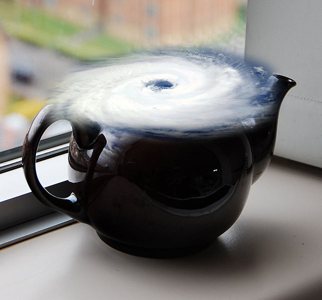

Composite by Durova (cyclone NASA/PD; teapot by Mendhak) · CC BY-SA 3.0

The idiom for an outsized fuss over something trivial (British cousin: "storm in a
teacup"). The teapot as a unit of *smallness* — the largest possible disturbance
that still fits in the tiniest vessel. Pure `proverbial` / `linguistic`, and
deliberately split from [[tempest-in-a-teapot-play]]: same phrase, but an
anonymous old idiom and a dated authored work are distinct phenomena sharing a
name (the split-vs-shift test).
