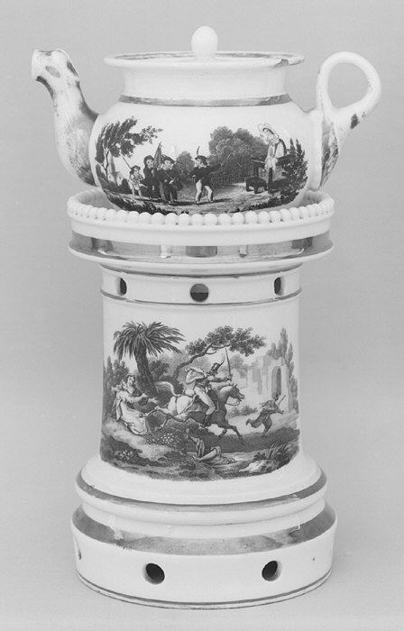

The Metropolitan Museum of Art · CC0

Dr. Frederick C. Freed — an NYU professor and Trenton native — spent some forty
years hunting antique shops for *veilleuses-théières*, the rare 18th–19th-century
porcelain **night-light teapots**, and donated 525 of them to Trenton, Tennessee,
in 1955. Displayed free, around the clock, inside the municipal building, they are
billed as the world's largest such collection, and the town now brands itself
around them with an annual Teapot Festival. Not merely "a teapot museum" but a
civic hoard of one specific, near-forgotten ceramic form — `collection` as the
preservation of a *type*, which is exactly what earns it a place here.
