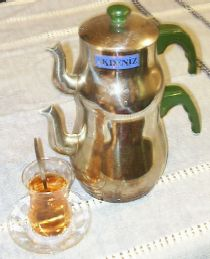

JX Bardant (French Wikipedia) · Public domain

The stacked double teapot of Turkey — a large lower kettle (*su kazanı*) boils the
water while a small upper pot (*demlik*) steeps a strong concentrate, and each
drinker dilutes to taste, from *koyu* (dark) to *açık* (light). Emblem of the
world's most tea-drinking nation, its two-tier form is the defining apparatus of a
whole national ritual. A quiet `duality`: one vessel holding both the strong brew
and the weak, the drinker choosing the ratio — a hospitable cousin of the
[[assassin-teapot]]'s two-chamber deception.
