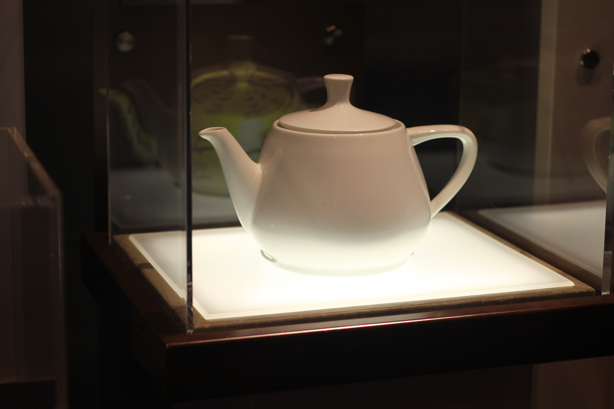

Michael Hicks · CC BY 2.0

Modelled in 1975 by Martin Newell in the University of Utah's computer-graphics
program. He needed a familiar test object; over tea, his wife Sandra suggested the
service on the table, and he sketched their **Melitta** teapot (bought from the
Salt Lake department store ZCMI) onto graph paper as Bézier control points. Newell
published the geometry, other labs seized on it, and it became the field's shared
benchmark — because it hit a perfect sweet spot of difficulty:

> "…round, contained saddle points, had a genus greater than zero because of the
> hole in the spout, could project a shadow on itself, and could be displayed
> accurately without a surface texture."

That is the whole reason it endured: complex enough to break a renderer, simple
enough to compute cheaply, and — through the spout's hole — topologically
interesting. It then took on a second life as computer graphics' in-joke, the
object the field hides in its own work: a tea-party scene in *Toy Story* (1995),
the 3-D world Homer falls into in *The Simpsons*' "Homer³", the `glutSolidTeapot()`
primitive shipped with GLUT. The physical pot, donated in 1984, now sits in the
Computer History Museum, catalogued X398.84.

## In the braid

The `ontology-shift` is the point: a real pot on a Utah kitchen table dissolved
into a set of coordinates that outlived and vastly outnumbered its referent, then
rematerialised on a million screens. That makes the Utah teapot a `reference-object`
in the *computational* sense — and its natural pair is the [[brown-betty]], the
`reference-object` in the *vernacular* sense: the pot Britain pictures when it
pictures a teapot, and the pot computing renders before anything else exists. Two
defaults, one domestic and one digital, for the same humble shape.
